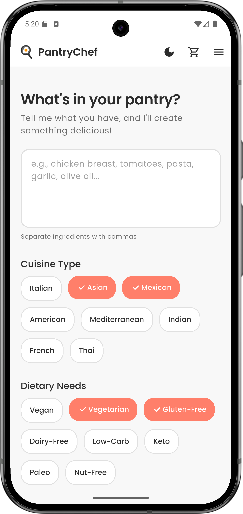
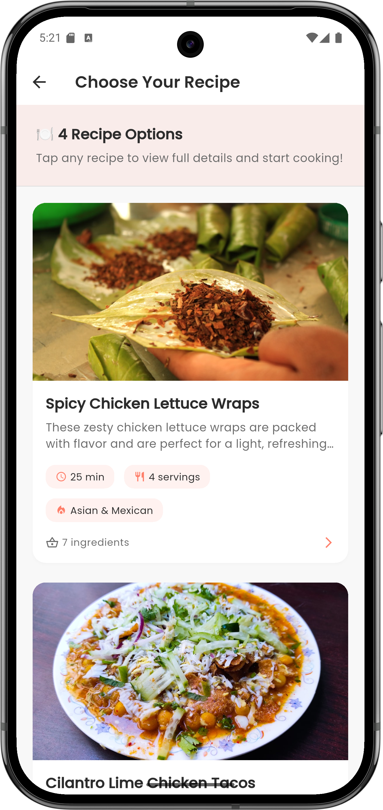
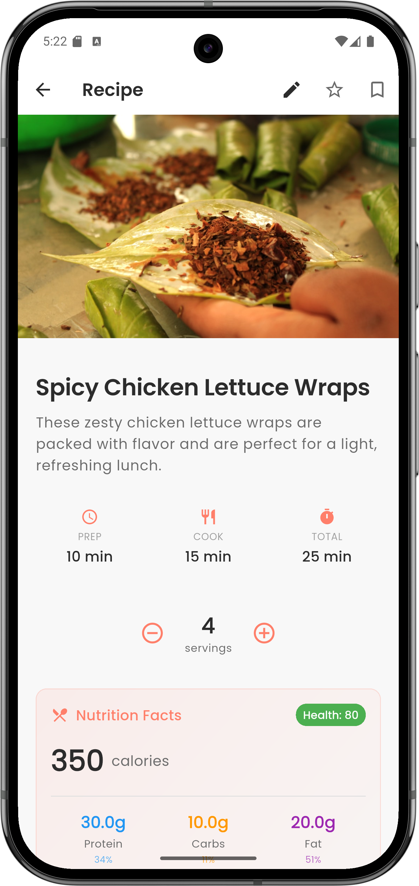
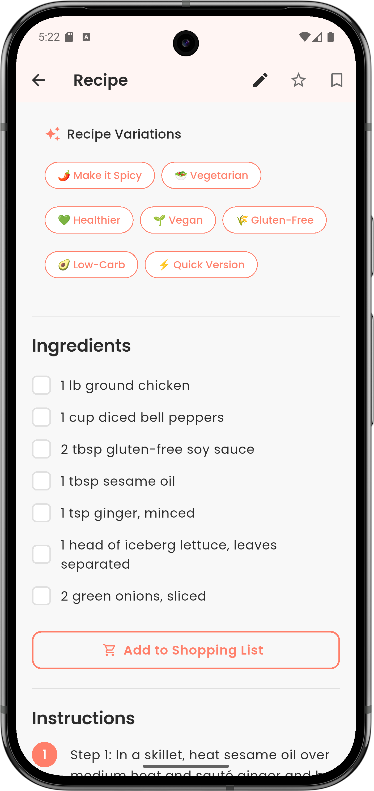
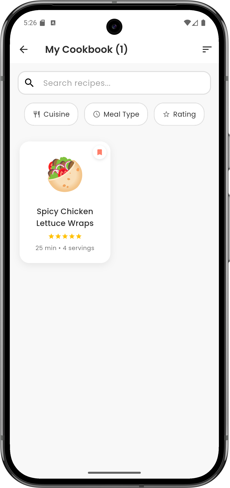
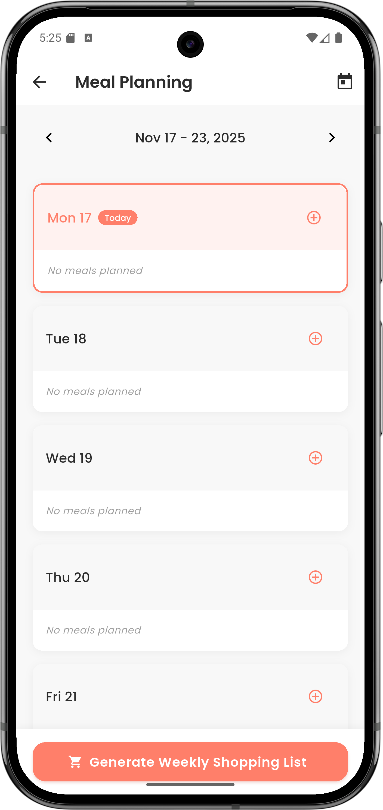
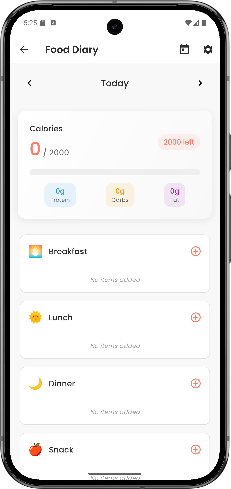
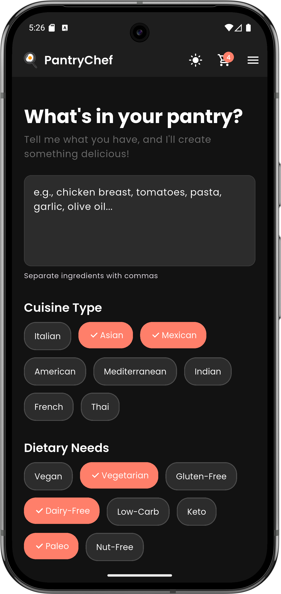

# PantryChef 🍳


An AI-powered mobile cooking companion that transforms your available ingredients into delicious, personalized recipes.

## Overview

PantryChef helps you discover what to cook based on what you already have. Simply enter your ingredients, select your preferences, and let AI generate creative recipes tailored to your pantry.

## 📊 Project Metrics

- 📱 **8 Fully-Functional Screens** with modern UI/UX (including authentication)
- 🤖 **AI-Powered Recipe Generation** using OpenAI GPT-4o-mini
- 🔐 **Complete Authentication System** with email/password and Google sign-in
- ☁️ **Cloud Data Synchronization** with Firebase Firestore
- 🌙 **Complete Dark Mode Implementation** across all screens
- 📸 **Professional Food Photography** via Unsplash API
- 📊 **6+ Core Features**: Meal planning, shopping lists, food diary, cookbook, nutrition tracking, user profiles
- 🎨 **Modern Design System** with Poppins typography and custom color palette
- 💾 **Local & Cloud Data Persistence** with offline-first architecture
- 🔧 **Clean Architecture** with service-based design pattern
- 🚀 **Enterprise-Ready Features**: User management, data backup, cross-device sync

## Features

### 🤖 AI-Powered Recipe Generation
- **Multiple Recipe Options**: Generate 3-10 recipes at once from your ingredients
- **Multi-Cuisine Selection**: Choose multiple cuisine types (e.g., "Italian & Asian fusion")
- **Multi-Meal Type**: Select multiple meal types (e.g., "Breakfast or Lunch")
- **Cooking Time Filter**: Set time constraints (15 min to 90+ min)
- **Dietary Preferences**: Multi-select dietary needs (Vegan, Gluten-Free, Keto, etc.)
- **Smart Variations**: Get diverse recipes with different cooking methods and flavors

### 📸 Visual Experience
- **Beautiful Food Photos**: Auto-fetched from Unsplash for every recipe
- **AI-Estimated Nutrition**: Calories, macros, fiber, sodium per serving
- **Health Scoring**: Visual health indicators and dietary labels
- **Allergen Detection**: Automatic allergen identification

### 📖 Personal Cookbook
- **Save Favorites**: Build your personal recipe collection
- **Recipe Rating**: Rate and add notes to saved recipes
- **Search & Filter**: Find recipes by name, cuisine, or dietary needs
- **Recipe Variations**: Generate healthier/spicier/vegetarian versions

### 🛒 Smart Meal Planning
- **Weekly Meal Planner**: Drag-and-drop meal scheduling
- **Shopping List**: Auto-generated from meal plans, grouped by recipe
- **Smart Grouping**: Ingredients organized by recipe source
- **Check-off System**: Track purchased items with visual feedback

### 👤 User Authentication & Cloud Sync
- **Secure Authentication**: Email/password and Google sign-in options
- **Cloud Data Sync**: Automatic synchronization across devices
- **User Profiles**: Personalized preferences and dietary restrictions
- **Offline Support**: Works offline with automatic cloud backup
- **Data Persistence**: Recipes, meal plans, and shopping lists saved to cloud

### 📊 Food Diary
- **Meal Tracking**: Log breakfast, lunch, dinner, and snacks
- **Photo Logging**: Add photos to meal entries
- **Calorie Tracking**: Daily calorie monitoring
- **Meal History**: View past meals and patterns

### 🎨 Modern UI/UX
- **Dark Mode**: Full dark theme support
- **Responsive Design**: Works on all screen sizes
- **Smooth Animations**: Delightful transitions and loading states
- **Accessibility**: Screen reader support and high contrast

## Design Documentation

Complete UI/UX design specifications are available in the following files:

- **[DESIGN_OVERVIEW.md](DESIGN_OVERVIEW.md)** - Executive summary of all design concepts
- **[DESIGN_SYSTEM.md](DESIGN_SYSTEM.md)** - Complete design system (colors, typography, components)
- **[SCREEN_1_HOME.md](SCREEN_1_HOME.md)** - Home/Input screen specifications
- **[SCREEN_2_LOADING.md](SCREEN_2_LOADING.md)** - Loading screen with animations
- **[SCREEN_3_RECIPE.md](SCREEN_3_RECIPE.md)** - Recipe display screen
- **[SCREEN_4_COOKBOOK.md](SCREEN_4_COOKBOOK.md)** - Cookbook collection screen
- **[USER_FLOW.md](USER_FLOW.md)** - Complete user journey documentation
- **[ASSETS_GUIDE.md](ASSETS_GUIDE.md)** - Visual assets and implementation guide

## Design Highlights

### Color Palette
- **Background**: #F8F8F8 (Off-White)
- **Accent**: #FF7F6A (Soft Coral)
- **Text**: #2C2C2C (Charcoal)
- **Success**: #4CAF50 (Fresh Green)

### Typography
- **Font**: Poppins (Google Fonts)
- **Weights**: 300, 400, 500, 600, 700
- **Clean hierarchy** for maximum readability

### Key Screens
1. **Home Screen**: Ingredient input with cuisine and dietary preference chips
2. **Loading Screen**: Delightful animations with rotating cooking tips
3. **Recipe Display**: Kitchen-ready layout with checkable ingredients
4. **Cookbook**: Personal collection with beautiful recipe cards

## Getting Started

### Prerequisites
- Flutter SDK (latest stable version)
- Dart SDK
- Android Studio / VS Code with Flutter extensions

### Installation

1. Clone the repository:
```bash
git clone <repository-url>
cd PantryChef
```

2. Install dependencies:
```bash
flutter pub get
```

3. Run the app:
```bash
flutter run
```

### Required Packages

Key dependencies in `pubspec.yaml`:
```yaml
dependencies:
  flutter:
    sdk: flutter
  
  # Design & UI
  google_fonts: ^6.1.0           # Poppins font
  cached_network_image: ^3.3.1   # Image caching
  
  # State Management & Storage
  shared_preferences: ^2.2.2     # Local storage
  provider: ^6.1.1               # State management
  
  # API & Environment
  http: ^1.1.0                   # HTTP requests
  flutter_dotenv: ^5.1.0         # Environment variables
```

## 🔧 Technical Challenges & Solutions

### AI Integration Complexity
- **Challenge**: Integrating OpenAI API for recipe generation with proper error handling and response parsing
- **Solution**: Implemented robust service layer with retry logic, fallback responses, and structured data models

### State Management
- **Challenge**: Managing complex app state across multiple screens (theme, recipes, meal plans)
- **Solution**: Used Provider pattern with dedicated providers for theme and centralized state management

### Image Caching & Performance
- **Challenge**: Loading high-quality food photos efficiently without performance issues
- **Solution**: Implemented cached_network_image with smart caching strategies and placeholder handling

### Responsive Design
- **Challenge**: Ensuring consistent UI across different screen sizes and orientations
- **Solution**: Built flexible layout system with constraints and responsive widgets

### API Rate Limiting
- **Challenge**: Handling API rate limits for both OpenAI and Unsplash services
- **Solution**: Implemented request queuing, caching, and graceful degradation

## Project Structure

```
lib/
├── main.dart
├── config/
│   └── api_config.dart              # API key configuration
├── screens/
│   ├── welcome_screen.dart          # Onboarding
│   ├── home_screen.dart             # Main input screen
│   ├── loading_screen.dart          # Recipe generation
│   ├── recipe_selection_screen.dart # Multiple recipe options
│   ├── recipe_screen_enhanced.dart  # Recipe details
│   ├── cookbook_screen_enhanced.dart# Saved recipes
│   ├── meal_planning_screen.dart    # Weekly planner
│   ├── shopping_list_screen.dart    # Shopping list
│   └── food_diary_screen.dart       # Meal tracking
├── widgets/
│   ├── recipe_card.dart             # Recipe preview cards
│   ├── nutrition_card.dart          # Nutrition display
│   ├── rating_dialog.dart           # Recipe rating
│   └── meal_plan_calendar.dart      # Calendar widget
├── models/
│   ├── recipe.dart                  # Recipe data model
│   ├── nutrition_info.dart          # Nutrition data
│   ├── meal_plan.dart               # Meal plan model
│   ├── shopping_list_item.dart      # Shopping item
│   └── food_diary_entry.dart        # Diary entry
├── services/
│   ├── recipe_service.dart          # OpenAI recipe generation
│   ├── recipe_variation_service.dart# Recipe variations
│   ├── nutrition_service.dart       # AI nutrition estimation
│   ├── unsplash_service.dart        # Food photo fetching
│   ├── cookbook_service.dart        # Local recipe storage
│   ├── meal_plan_service.dart       # Meal planning
│   ├── shopping_list_service.dart   # Shopping list
│   └── food_diary_service.dart      # Diary tracking
├── providers/
│   └── theme_provider.dart          # Dark mode state
└── theme/
    └── app_theme.dart               # Design system

assets/
└── .env                             # API keys (not committed)
```

## Development Roadmap

### Phase 1: Design & Planning ✅
- [x] Design system definition
- [x] Screen mockups and specifications
- [x] User flow documentation
- [x] Asset requirements

### Phase 2: Core Implementation ✅
- [x] Set up project structure
- [x] Implement theme and design system
- [x] Build Home/Input screen
- [x] Build Loading screen with animations
- [x] Build Recipe Display screen
- [x] Build Cookbook screen

### Phase 3: Features & Integration ✅
- [x] OpenAI API integration for recipe generation
- [x] Multiple recipe generation (3-10 recipes at once)
- [x] Unsplash API for food photography
- [x] AI-powered nutrition estimation
- [x] Local storage for saved recipes
- [x] Recipe rating and notes system
- [x] Recipe variation generation
- [x] Search and filter functionality
- [x] Meal planning system
- [x] Shopping list with smart grouping
- [x] Food diary with calorie tracking

### Phase 4: Polish & Testing ✅
- [x] Smooth animations and transitions
- [x] Dark mode support
- [x] Responsive design for all screen sizes
- [x] Accessibility improvements
- [x] Performance optimization
- [x] Error handling and network resilience
- [x] Loading states and user feedback
- [x] Multi-select preferences (cuisine, meal type)
- [x] Cooking time filter
- [x] Recipe count selection (3-10 recipes)

## Contributing

Contributions are welcome! Please read the design documentation before making UI changes to maintain consistency.

## License

This project is licensed under the MIT License - see the LICENSE file for details.

## Technology Stack

### Frontend Framework
- **Flutter 3.9+** - Cross-platform mobile development with expressive UI
- **Dart** - Type-safe, high-performance programming language

### AI & APIs
- **OpenAI GPT-4o-mini** - Advanced recipe generation and nutrition estimation
- **Unsplash API** - High-quality food photography integration
- **HTTP Client** - Robust API communication with error handling

### Authentication & Cloud Services
- **Firebase Authentication** - Secure user authentication with multiple providers
- **Cloud Firestore** - Real-time cloud database with offline support
- **Google Sign-In** - Seamless OAuth integration
- **Cloud Sync** - Automatic data synchronization across devices

### State Management & Architecture
- **Provider Pattern** - Reactive state management with clean separation
- **Service-Based Architecture** - Modular, testable, and maintainable code
- **Repository Pattern** - Data access layer abstraction

### Storage & Persistence
- **SharedPreferences** - Local data persistence for offline functionality
- **Cloud Storage** - User data backup and cross-device sync
- **JSON Serialization** - Efficient data modeling and parsing

### UI/UX & Design
- **Google Fonts (Poppins)** - Modern typography system
- **Custom Design System** - Consistent color palette and component library
- **Dark Mode Support** - Complete theme switching implementation
- **Responsive Design** - Adaptive layouts for all screen sizes

### Development Tools
- **Environment Variables** - Secure API key management
- **Image Caching** - Performance optimization for media content

## Acknowledgments

- **OpenAI** for GPT-4o-mini API powering recipe generation
- **Unsplash** for beautiful food photography
- Design inspired by modern minimalist food apps
- Icons from Material Icons
- Community feedback and testing

---

## Quick Start

### 1. Setup Environment Variables

**Copy the example file:**
```bash
cp .env.example .env
```

**Add your API keys to `.env`:**
```env
OPENAI_API_KEY=your_openai_api_key_here
OPENAI_MODEL=gpt-4o-mini
UNSPLASH_ACCESS_KEY=your_unsplash_access_key_here
```

**Get your API keys:**
- OpenAI: https://platform.openai.com/api-keys
- Unsplash: https://unsplash.com/developers

⚠️ **Important:** Never commit your `.env` file to GitHub! It's already in `.gitignore`.

### 2. Install Dependencies
```bash
flutter pub get
```

### 3. Run the App
```bash
flutter run
```

### 4. Generate Recipes!

**How to use:**
1. Enter your available ingredients (comma-separated)
2. Select preferences:
   - **Multiple cuisines** (e.g., Italian + Asian)
   - **Multiple meal types** (e.g., Lunch or Dinner)
   - **Dietary needs** (Vegan, Gluten-Free, etc.)
   - **Cooking time** (15 min to 90+ min)
   - **Number of recipes** (3-10 options)
3. Tap "Generate Recipes"
4. Choose from multiple AI-generated options
5. View full recipe with:
   - Beautiful food photo
   - AI-estimated nutrition facts
   - Step-by-step instructions
   - Ingredient checklist
6. Save favorites to your cookbook
7. Plan meals and generate shopping lists

---

## Environment Setup

This project uses environment variables to keep API keys secure:

- **`.env`** - Your actual API keys (never commit this!)
- **`.env.example`** - Template file (safe to commit)
- **`api_config.dart`** - Loads keys from `.env` file

**For contributors:** Copy `.env.example` to `.env` and add your own API keys.

---

## App Screenshots & Features

### 🏠 Home Screen
- Multi-select cuisine types (Italian, Asian, Mexican, etc.)
- Multi-select meal types (Breakfast, Lunch, Dinner, etc.)
- Multi-select dietary preferences (8 options)
- Cooking time filter (15 min to 90+ min)
- Recipe count selector (3-10 recipes)

### 🎲 Recipe Selection
- View 3-10 AI-generated recipe options at once
- Each with photo, description, and key details
- Tap any recipe to view full details

### 📖 Recipe Details
- Beautiful food photography
- AI-estimated nutrition (calories, protein, carbs, fat)
- Health score and dietary labels
- Allergen warnings
- Step-by-step instructions
- Ingredient checklist
- Save to cookbook
- Generate variations (healthier, spicier, etc.)

### 📚 Cookbook
- All saved recipes in one place
- Search by name
- Filter by cuisine or dietary needs
- Rate and add notes
- Quick access to favorites

### 📅 Meal Planner
- Weekly calendar view
- Drag-and-drop meal scheduling
- Breakfast, lunch, dinner, snack slots
- Generate shopping list from plan

### 🛒 Shopping List
- Auto-generated from meal plans
- Grouped by recipe
- Check-off system
- Swipe to delete
- Clear checked items

### 📊 Food Diary
- Log all meals with photos
- Daily calorie tracking
- Meal history
- Visual progress tracking

## 📸 App Screenshots

### 🏠 Home Screen

*Multi-select cuisine types, meal preferences, dietary needs, and cooking time filters*

### 🎲 Recipe Selection  

*View 3-10 AI-generated recipe options at once with photos and descriptions*

### 📖 Recipe Details


*Beautiful food photography, AI-estimated nutrition, health scores, and step-by-step instructions*

### 📚 Cookbook

*Saved recipes collection with search, filtering, and rating capabilities*

### 📅 Meal Planner

*Weekly calendar view with drag-and-drop meal scheduling*

### 🛒 Shopping List

*Auto-generated shopping lists grouped by recipe with check-off system*

### 📊 Food Diary

*Meal tracking with photo logging and daily calorie monitoring*

### 🌙 Dark Mode Support

*Full dark theme support across all screens for comfortable evening cooking*

---

**Status**: ✅ Production Ready | 🚀 Fully Functional

**Key Features:**
- ✅ Multi-recipe generation (3-10 at once)
- ✅ Multi-select preferences
- ✅ AI nutrition estimation
- ✅ Beautiful food photos
- ✅ Meal planning & shopping lists
- ✅ Food diary with calorie tracking
- ✅ Dark mode support
- ✅ Offline recipe storage

**Documentation:**
- [OpenAI Setup Guide](OPENAI_SETUP.md) - API key setup
- [Getting Started Guide](GETTING_STARTED.md) - App usage
- [Design Overview](DESIGN_OVERVIEW.md) - Design specifications
